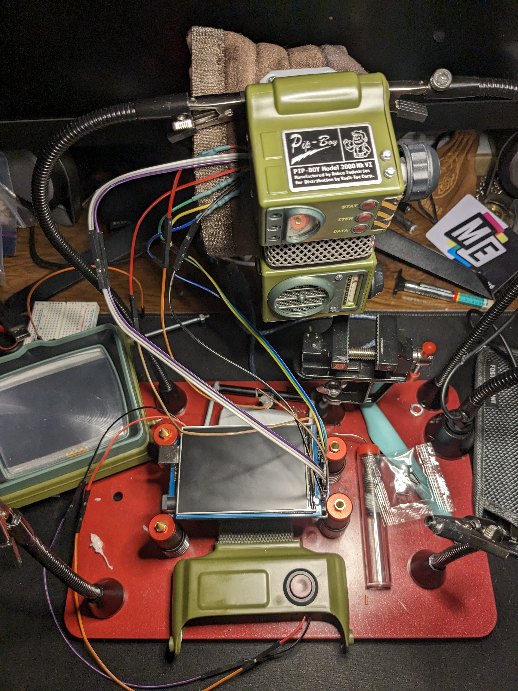
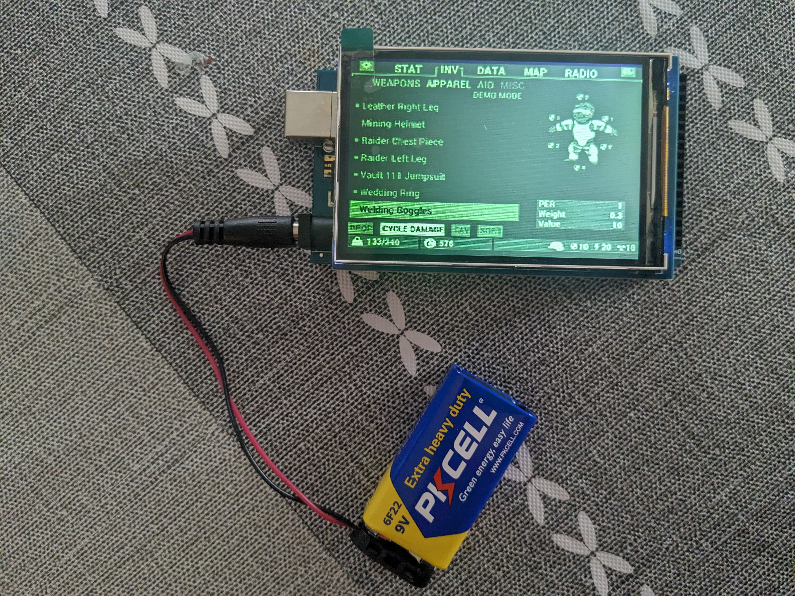

# Pip-Boy 3000 MkVI — Arduino OS 🤖☢️

[](https://youtu.be/vCLyTWwi2Qk)

---

## Origin

My wife bought me the Wand Company's official Pip-Boy 3000 replica. It's a beautiful shell -- screen, dials, buttons, the whole aesthetic -- but it shipped as a display model. No actual functionality. It sat on my shelf for a couple of years, fully assembled, looking at me.

Eventually I couldn't take it anymore.

I had no background in Arduino, C, or hardware programming. I knew Python at a surface level and had never done embedded development. What I had was a prop that deserved to actually work, a clear vision of what "working" meant -- and the stubbornness to figure out the rest.

The design constraint I set for myself: **no touchscreen cop-outs.** If the physical Pip-Boy has a rotary knob, you navigate with the rotary knob. If it has tab buttons, the tab buttons switch tabs. The analog controls had to be wired and functional. A touchscreen interface would have been faster to build and completely wrong.

So I wired it up properly, learned C/C++ as I went, wrote the UI logic from scratch, extracted and converted bitmap assets from the game, and built a multi-tab OS that runs on an Arduino Mega with an RA8875 TFT display.

*War never changes. But sometimes you have to write your own firmware.*

---

## What It Does

Full tabbed interface with rotary knob navigation and physical button controls:

- **STAT tab** -- S.P.E.C.I.A.L. stats with per-stat Vault Boy illustrations, HP/AP display, active effects and debuffs with Geiger counter sound and LED flicker
- **ITEM tab** -- Scrollable weapon list with per-weapon stats
- **DATA tab** -- Date/time display, extensible for notes and quests
- **Boot sequence** -- Teletype-style scrolling startup text with sound and Vault-Tec splash screen

Hardware: Arduino Mega 2560, Adafruit RA8875 800×480 TFT, rotary encoder, physical tab buttons, passive buzzer, Geiger LEDs. All controls wired to actual inputs -- no touch required.

---

| Workbench | Display running on 9V |
|---|---|
|  |  |

---

*The full technical documentation, hardware pinout, dependencies, and known issues follow below.*

---

## Features

- **Tabbed navigation** — STAT / ITEM / DATA / RADIO tabs with Pip-Boy-style active tab outlines
- **STAT tab** with sub-sections:
  - **STATUS** — HP, AP, active effects (radiation, hunger, addiction) with Vault Boy graphic
  - **EFFECTS** — Active debuffs with stat penalties listed
  - **S.P.E.C.I.A.L.** — Scrollable stat list with per-stat Vault Boy illustrations and descriptions
- **ITEM tab** — Weapon list with scrollable selector and per-weapon stats (damage, range, etc.)
- **DATA tab** — Date/time display, extensible for notes/quests
- **Bottom status bar** — Context-sensitive HP/AP, weight/caps, or date/time depending on active tab
- **Geiger counter effect** — Random buzzer tones and LED flicker on the EFFECTS screen
- **Boot sequence** — Scrolling teletype-style startup text with sound
- **Startup splash screen** — Vault-Tec logo + Vault Boy bitmap

---

## Hardware

| Component | Detail |
|-----------|--------|
| Microcontroller | Arduino Mega (or compatible with enough I/O) |
| Display | Adafruit RA8875 800×480 TFT |
| Knob | Rotary encoder (pins 35/37) |
| Buttons | STAT (45), ITEM (47), DATA (49), DIAL (39) |
| Geiger LEDs | 3 LEDs on pins 32, 34, 36 |
| Light output | Geiger lamp pin 31, Radio lamp pin 33 |
| Buzzer | Passive buzzer on pin 53 |
| Display CS | Pin 10 |
| Display RESET | Pin 9 |
| Display INT | Pin 3 |

---

## Dependencies

Install these via the Arduino Library Manager:

- [Adafruit RA8875](https://github.com/adafruit/Adafruit_RA8875)
- [Adafruit GFX Library](https://github.com/adafruit/Adafruit-GFX-Library)
- [Rotary](https://github.com/brianlow/Rotary)

---

## Project Structure

```
/
├── pipboy.ino          # Main sketch
├── pipboy_text.h       # All PROGMEM strings, bitmaps, and stat data
```

Bitmap assets (Vault Boy, weapon images, icons) and all text data live in `pipboy_text.h` stored in PROGMEM to save RAM.

---

## Controls

| Input | Action |
|-------|--------|
| STAT button | Switch to STAT tab |
| ITEM button | Switch to ITEM tab |
| DATA button | Switch to DATA tab |
| Rotary knob (CW/CCW) | Scroll through items/stats in current section |
| Dial button (press) | Cycle through sub-sections within current tab |

---

## Known Issues / TODOs

- `playGigerTones()` logic has a redundant branch (both `< 5` and `> 5 && < 8` conditions trigger the same output) — needs cleanup
- RADIO tab navigation exists but content is not yet implemented
- Geiger needle pulse is marked `TODO` in the code
- Boot sequence is partially commented out — multiple versions were tested; only the character-by-character version is active
- `clearSPECIAL()` uses blank string printing instead of `fillRect` for clearing — works but is slow

---

## Credits

Built with a lot of help from ChatGPT for the initial scaffolding, and a lot of manual wiring, soldering, and bitmap pixel-pushing to bring it to life.

Inspired by the Pip-Boy 3000 from the Fallout series by Bethesda Game Studios.

---

*War never changes. But the code does.*
